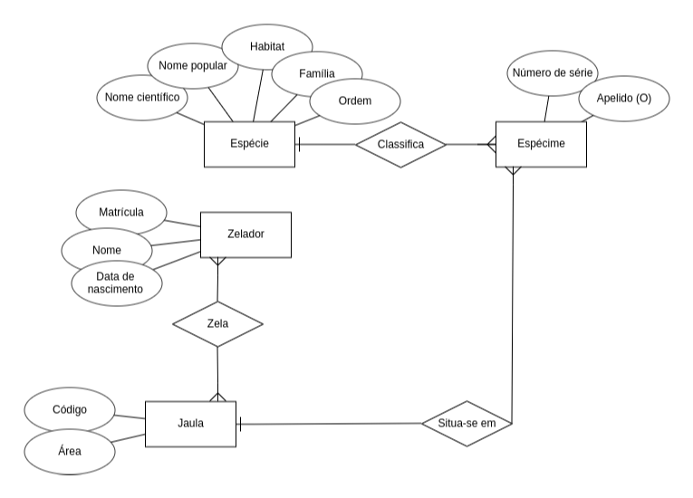

# zoologico

## Sumário

- [zoologico](#zoologico)
  - [Sumário](#sumário)
  - [Motivação](#motivação)
  - [Base de dados relacional](#base-de-dados-relacional)
  - [Pilha de tecnologia](#pilha-de-tecnologia)
  - [Galeria](#galeria)
  - [Como rodar](#como-rodar)
    - [Pré-requisitos](#pré-requisitos)
    - [Passo a passo](#passo-a-passo)

## Motivação

Este app consiste em um sistema de um zoológico.

Este foi o terceiro repositório de código apresentado no [Curso Superior de TSI do IFMS](https://www.ifms.edu.br/campi/campus-aquidauana/cursos/graduacao/sistemas-para-internet/sistemas-para-internet) como requisito para obtenção da nota parcial das atividades da unidade curricular Linguagem de Programação I.

## Base de dados relacional

Eis as tabelas do banco de dados desta atividade:

| Espécie |
|-|
| ID |
| Nome científico |
| Nome popular |
| Habitat |
| Família |
| Ordem |

| Espécime |
|-|
| ID |
| &numero; de série |
| Apelido |
| Espécie |
| Jaula |

| Zelador |
|-|
| Matrícula |
| Nome |
| Data de nascimento |

| Jaula |
|-|
| Código |
| Área |

## Pilha de tecnologia

As seguintes tecnologias foram utilizadas para desenvolver este app:

| Papel | Tecnologia |
|-|-|
| Ambiente de execução | [Node](https://nodejs.org/en/) |
| Linguagem de programação | [TypeScript](https://www.typescriptlang.org/) |
| Virtualização de banco de dados | [Docker](https://www.docker.com/) |
| Banco de dados | [PostgreSQL](postgresql.org) |

## Galeria




## Como rodar

### Pré-requisitos

- [Node](https://nodejs.org/en/download/);
- [Yarn](https://yarnpkg.com/) (opcional);
- [Docker](https://docs.docker.com/engine/install/).

### Passo a passo

1. Clone o repositório de código em sua máquina;
   
2. Abra um shell de comando de sua preferência (prompt de comando, PowerShell, terminal _etc_.);

3. Instale as dependências do projeto através do seguinte comando:

```console
$ npm install
```

Caso esteja utilizando o gerenciador de pacotes Yarn, execute o seguinte comando como alternativa:

```console
$ yarn
```

4. Com o Docker instalado, execute o comando abaixo para levantar o _container_ Docker com o respectivo banco de dados virtualizado. Certifique-se de estar no diretório do arquivo `docker-compose.yml`;

```console
$ docker-compose up -d
```

O parâmetro `-d` serve para desocupar o shell de comando logo após a execução do comando. É uma boa convenção, ao encerrar a execução do app, derrubar o _container_ levantado através do comando:

```console
$ docker-compose down
```

Mas, não se preocupe. As tuplas inseridas no banco de dados não serão deletadas com a derrubada do _container_.

5. Finalmente, execute o seguinte comando para iniciar o app:

Para npm:

```console
$ npm run dev
```

Para Yarn:

```console
$ yarn dev
```